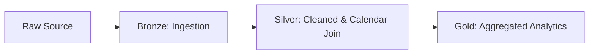

# Transportation Lakeflow Pipeline

### Turning Raw Transportation Events into Trusted Analytics with Databricks DLT


A modern, medallion-based data engineering pipeline for transportation and trip analytics. This project uses Databricks Delta Live Tables (DLT) and Lakeflow to ingest, refine, and aggregate trip data across Bronze, Silver, and Gold layers, with time-series enrichment through a custom Calendar dimension.

## Architecture

The pipeline follows Medallion Architecture to improve reliability, observability, and analytical readiness.



### Layer Responsibilities

- **Bronze:** Ingest raw city and trip datasets with minimal transformations.
- **Silver:** Standardize types, enforce quality checks, and enrich trips with a custom Calendar table.
- **Gold:** Publish analytics-ready tables (city-level outputs) optimized for BI and reporting.

## Tech Stack

- Databricks
- Delta Live Tables (DLT)
- Lakeflow
- PySpark
- Python
- Unity Catalog

## Key Features

- **Automated Schema Evolution:** Handles evolving source schemas while reducing manual intervention.
- **Data Quality Expectations:** Applies DLT expectations to maintain consistency and reliability across layers.
- **Parameter-driven ETL:** Uses runtime Spark configs (`start_date`, `end_date`) for dynamic, windowed processing.

## Project Structure

```text
Goodcabs-Travels/
├── transformations/
│   ├── bronze/
│   │   ├── city.py
│   │   └── trips.py
│   ├── silver/
│   │   ├── calendar.py
│   │   ├── city.py
│   │   └── trips.py
│   └── gold/
│       ├── trips_gold.sql
│       ├── trips_chandigarh.sql
│       ├── trips_coimbatore.sql
│       ├── trips_indore.sql
│       ├── trips_jaipur.sql
│       ├── trips_kochi.sql
│       ├── trips_lucknow.sql
│       ├── trips_mysore.sql
│       ├── trips_surat.sql
│       ├── trips_vadodara.sql
│       └── trips_visakhapatnam.sql
└── README.md
```

## Setup Guide

### 1) Configure Pipeline Parameters in DLT JSON

Set `start_date` and `end_date` in your DLT/Lakeflow pipeline configuration to control the processing window.

```json
{
  "configuration": {
    "start_date": "2024-01-01",
    "end_date": "2024-12-31"
  }
}
```

### 2) Access Parameters in PySpark Code

These values are typically accessed through Spark configs inside your transformation scripts.

```python
start_date = spark.conf.get("start_date")
end_date = spark.conf.get("end_date")
```

### 3) Run Pipeline

- Deploy notebooks/scripts to your Databricks workspace.
- Create or update your DLT/Lakeflow pipeline.
- Execute pipeline and monitor expectations, lineage, and table updates.

## Data Quality and Governance

- Built with DLT expectations for predictable, testable pipelines.
- Unity Catalog-ready design for secure governance and discoverability.
- Layered model supports clear lineage from raw ingestion to business outputs.

## Visuals

### Pipeline Dashboard


### Lineage View


> Replace placeholders with your actual screenshots after pipeline deployment.

## Future Enhancements

- Add CI/CD for automated deployment and validation.
- Introduce data drift monitoring for trip KPIs.
- Expand Gold models for route-level and demand forecasting analytics.

## Contributing

Contributions are welcome. If you want to improve transformations, add quality rules, or optimize Gold models, open an issue or submit a pull request.

## License

Specify your license here (e.g., MIT).
