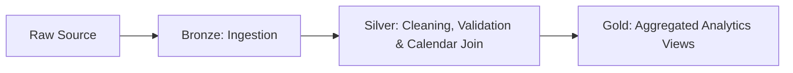

# Transportation Lakeflow Pipeline

### From raw trip events to governed analytics in Databricks


Transportation Lakeflow Pipeline is a medallion-style data engineering solution for trip and city analytics. It uses Databricks Delta Live Tables, Lakeflow, and PySpark to move data from raw ingestion into cleaned, enriched, and business-ready gold outputs.

## Architecture

The pipeline follows the Bronze -> Silver -> Gold pattern to keep each transformation layer focused and easy to maintain.



### Layer Breakdown

- **Bronze:** Ingests raw city and trip files from object storage using schema evolution and Auto Loader where needed.
- **Silver:** Standardizes trip fields, applies data quality expectations, and builds a reusable calendar dimension from the configured date range.
- **Gold:** Joins trips with city and calendar dimensions to produce analytics-ready views for reporting and dashboards.

## Features

- **Automated Schema Evolution** - Handles changing source structures with minimal manual intervention.
- **Data Quality Expectations** - Uses DLT expectations to validate trip dates and rating ranges.
- **Parameter-driven ETL** - Reads `start_date` and `end_date` from Spark configuration to control the calendar range and pipeline window.

## Folder Guide

```text
Goodcabs-Travels/
└── transformations/
    ├── bronze/
    │   ├── city.py
    │   └── trips.py
    ├── silver/
    │   ├── calendar.py
    │   ├── city.py
    │   └── trips.py
    └── gold/
        ├── trips_gold.sql
        ├── trips_chandigarh.sql
        ├── trips_coimbatore.sql
        ├── trips_indore.sql
        ├── trips_jaipur.sql
        ├── trips_kochi.sql
        ├── trips_lucknow.sql
        ├── trips_mysore.sql
        ├── trips_surat.sql
        ├── trips_vadodara.sql
        └── trips_visakhapatnam.sql
```

### Bronze

- `bronze/city.py`: Reads raw city data from S3 and adds file metadata and ingest timestamps.
- `bronze/trips.py`: Streams raw trip data with Auto Loader, renames problematic columns, and captures ingest metadata.

### Silver

- `silver/calendar.py`: Generates a date dimension from `start_date` to `end_date`, adds date attributes, and flags weekends and holidays.
- `silver/city.py`: Cleans the city dimension and carries forward bronze ingest metadata.
- `silver/trips.py`: Normalizes trip data, applies expectations, and prepares a CDC-friendly silver table.

### Gold

- `gold/trips_gold.sql`: Builds the main gold analytics view by joining trip, city, and calendar data.
- `gold/trips_*.sql`: City-specific gold views for targeted reporting and dashboard slices.

## How to Configure

Set the pipeline window in the DLT JSON settings before running the pipeline.

```json
{
  "configuration": {
    "start_date": "2024-01-01",
    "end_date": "2024-12-31"
  }
}
```

In the transformation code, the calendar layer reads these values directly from Spark:

```python
start_date = spark.conf.get("start_date")
end_date = spark.conf.get("end_date")
```

## Data Model

- **Bronze city:** raw city attributes plus file lineage metadata.
- **Bronze trips:** raw trip events with source metadata and standardized column names.
- **Silver calendar:** date dimension with fiscal-style attributes, weekdays, weekends, and holiday flags.
- **Silver trips:** cleaned transactional trip data ready for downstream joins.
- **Gold fact trips:** combined trip, city, and calendar view for analytics.

## Dashboards

### KPI Snapshot

| Metric | Value | Visual |
|---|---:|---|
| Total Revenue | $94M |  |
| Total Trips | 366.14K |  |
| Avg Distance (km) | 19.21 | .png) |
| Avg Passenger Rating | 7.68 |  |
| Holiday Trips | 4.93K |  |
| Weekday Trips | 284.88K |  |
| Weekend Trips | 81.26K |  |

### Trend Analysis


### Segment Analysis


These visuals are sourced from the [Dashboards](Dashboards) folder and represent the current Gold-layer analytics outputs.

## Deployment Notes

- Use Unity Catalog objects for governed table and view registration.
- Configure the pipeline with the required DLT JSON parameters before deployment.
- Run the Bronze, Silver, and Gold layers in Databricks to materialize the full medallion flow.

## Contributing

Pull requests that improve transformations, documentation, or analytics coverage are welcome.

## License

Add your preferred license here.